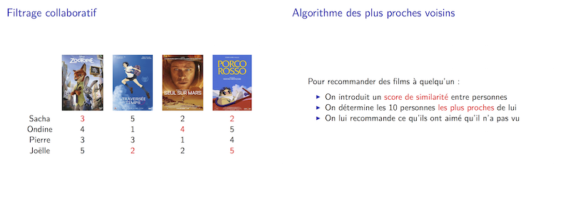

# movielens
Système de recommandation minimal (100 lignes de Python¹) sur le jeu de données de Movielens.

¹ Oui je sais qu'on peut faire moins, Étienne.

## Slides de la présentation donnée à Girls Can Code! 2016

Pour compiler les slides avec ``pandoc``, faites : ``make``.

## Usage

Téléchargez l'archive ou clonez le repo puis :

    cd code
    python3 reco.py

## Exemple

Au début le système demande de noter les 10 œuvres les plus populaires. 

- 1 : J'ai aimé
- -1 : Je n'ai pas aimé
- 0 : Je ne sais pas

Ensuite, 20 œuvres sont recommandées par note (prédite) croissante :

    99855 notes chargées de 668 personnes sur 9800 films
    Prénom ? JJ
    As tu aimé Schindler's List (1993) ? (244 notes) 0 
    As tu aimé Braveheart (1995) ? (247 notes) -1
    As tu aimé Terminator 2: Judgment Day (1991) ? (249 notes) 1
    As tu aimé Matrix, The (1999) ? (257 notes) 1
    As tu aimé Star Wars: Episode IV - A New Hope (1977) ? (270 notes) -1
    As tu aimé Silence of the Lambs, The (1991) ? (284 notes) 1
    As tu aimé Jurassic Park (1993) ? (289 notes) 0
    As tu aimé Forrest Gump (1994) ? (307 notes) 1
    As tu aimé Shawshank Redemption, The (1994) ? (307 notes) 1
    As tu aimé Pulp Fiction (1994) ? (321 notes) 1
    ...
    (0.48, 'Blade Runner (1982)')
    (0.48, 'Dances with Wolves (1990)')
    (0.48, 'Fargo (1996)')
    (0.48, 'Indiana Jones and the Last Crusade (1989)')
    (0.48, 'Léon: The Professional (a.k.a. The Professional) (Léon) (1994)')
    (0.48, 'Memento (2000)')
    (0.48, 'Sixth Sense, The (1999)')
    (0.48, 'Star Wars: Episode V - The Empire Strikes Back (1980)')
    (0.52, 'Batman (1989)')
    (0.52, 'Lord of the Rings: The Fellowship of the Ring, The (2001)')
    (0.54, 'American Beauty (1999)')
    (0.54, 'Raiders of the Lost Ark (Indiana Jones and the Raiders of the Lost Ark) (1981)')
    (0.54, 'Twelve Monkeys (a.k.a. 12 Monkeys) (1995)')
    (0.6, 'Back to the Future (1985)')
    (0.62, 'Fugitive, The (1993)')
    (0.62, 'Usual Suspects, The (1995)')
    (0.64, "Schindler's List (1993)")
    (0.64, 'Toy Story (1995)')
    (0.7, 'Seven (a.k.a. Se7en) (1995)')
    (0.72, 'Jurassic Park (1993)')
